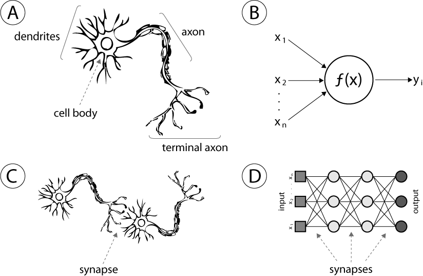

Debate:
> **Inanimate**: the organization of mechanical processes is sufficient to explain life (**MY POSITION**)

> **Animate**: life processes require an appeal to scenes, souls, drives, a will, a vital force, or some other processes beyond mere mechanical organization 

We are forever searching for explanations for phenomenons, and until I began to peruse the literature about machine learning and artificial intelligent systems, I too believed that there was something special about humans, some invisible force that guided our intuitions. However, what I learned is that this behavior can be replicated by logical machines, which means that it could be explained mechanistically. Foremost, to draw parallels between humans and machines, it is helpful to understand that artificially intelligent programs aren't just a set of if-else statements. Engineers at DeepMind that built [AlphaGo](https://deepmind.com/research/alphago/) did not sit down and tediously work through every single possibility of the game GO; incidentally, that would be humanly and computationally impossible to do because the possible legal moves in Go are far greater than there are atoms in our observable universe ([wiki](https://en.wikipedia.org/wiki/Go_and_mathematics)). In fact, AI systems are built on powerful, yet simple, statistical principles that also seem to govern how biological neurons operate. These "artificial" networks of electrical nodes are not only beginning to closely resemble the looks and functionality of the mesh of neurons in our brain, but they are also surpassing human performance in many tasks. 

To provide some insight into how an AI can mimic human's quirks and intuitions, we can draw parallel between the functionality of human brain and AI brain. Attached is a picture of several neurons and neuron networks. (A) is the picture of biological neuron and (B) is the picture of a neuron in an artificial neuron; (C) and (D) are the neurons connected to other neurons by synapses in brains and machines, respectively. Just like for humans "actions of neurons and the patterns of connections among groups of neurons cause perception, thought, feelings, [and] consciousness" ([Mitchell](https://drive.google.com/file/d/0B4me4PbBMBmOa2VpUHdUYWZWdXM/view) pg. 6), the artificial neurons (B,D) can also mimic these behaviors. During their developmental stages (called training), artificial neurons go through a very similar process where the neurons "learn". The learning process is demonstrated by the function f(x) shown in (B); f(x) changes and is optimized overtime by the positive/negative experiences the AI undergoes. Just as our experiences guide our behavior, AI's behavior is fueled by the data given to it. 

Finally, such artificial neural networks (ANN) have been shown to accomplish extraordinary feats, even [outperforming humans](https://venturebeat.com/2017/12/08/6-areas-where-artificial-neural-networks-outperform-humans/) in a few, and I think they demonstrate that human beings and all life can be sufficiently explained by the organization of mechanical processes. 

